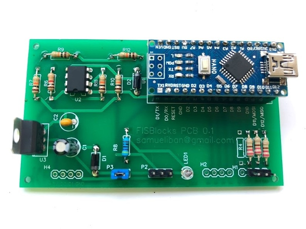
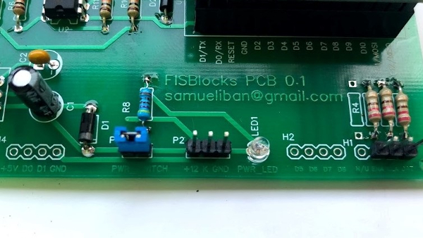
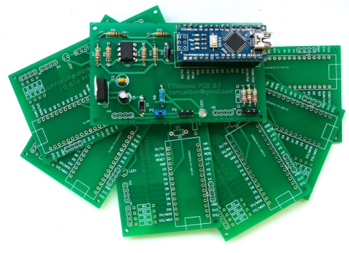
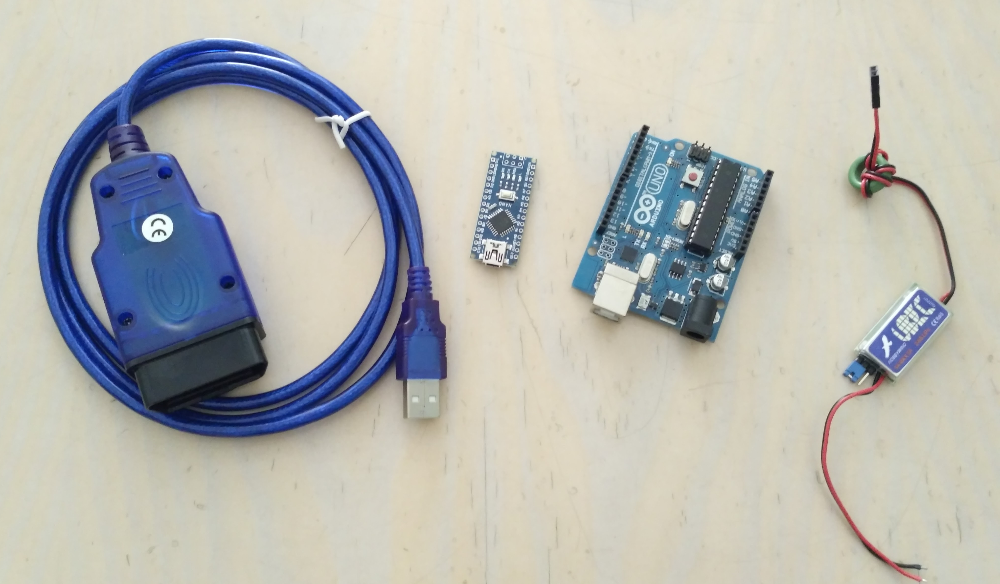
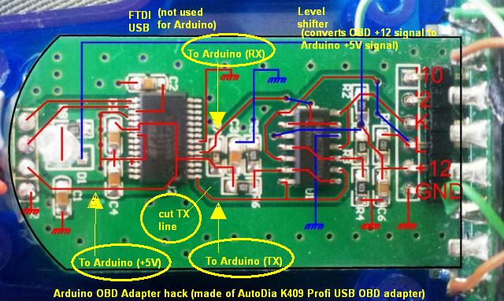
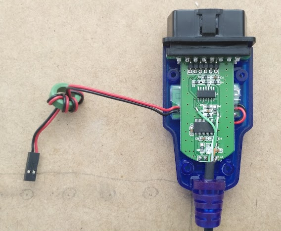
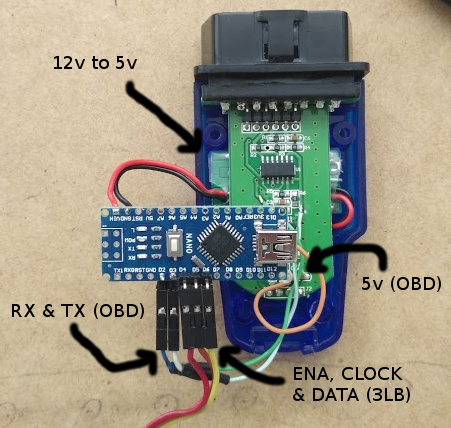

# Bienvenido a FISBlocks!

[[ENG]](./Readme.md)
[ESP]

## Resumen:

El FISBlocks es un dispositivo basado en Arduino que nos permite consultar en tiempo real parámetros mecánicos del vehículo para diagnosticar su estado y predecir averías. Implementa parte del protocolo privado KWP1281 usado en todos los vehículos del grupo VAG (Audi, Seat, Volkswagen...) desde el año 1998 para realizar la diagnosis y obtener la información. Además este dispositivo también implementa parte del protocolo privado 3LB que nos permite controlar el contenido que se muestra por la pantalla de los cuadros de instrumentos que incorporan tecnología FIS-DIS.

Algunos de los datos interesantes que podemos obtener:
* Litros de combustible
* Temperatura real de refrigerante
* AFR
* Presión de turbo
* IAT
* EGT
* Retrasos/cilindro
* Misfires/cilindro
* MAF
* Voltaje
* Carga del motor
* Valores demandados por la ECU
* ...Y en general, cualquier dato que se pueda obtener a través del Measurement Blocks de la unidad.

.

Este proyecto tiene principalmente 2 objetivos:

* Extraer información de las unidades de mando del vehículo utilizando el protocolo KWP1281 y el Measurement Blocks.

* Implementar protocolo 3LB para mostrar información en el cuadro de instrumentos.

### Actualización 10/08/2018!!!

.
.

FISBlocks PCB terminado! Como el montaje del circuito utilizando un cable KKL no es muy práctico he desarrollado este PCB para desarrollo.
Su función es exactamente la misma pero el resultado es mas integrado, no hay riesgo de equivocarse comprando el cable y es mas facil de integrarlo en el coche.

FISBlocks PCB está disponible en unidades limitadas, los precios son los siguientes:

* 1 unidad -> 50€
* 5 unidades -> 200€

.

* Gastos de envío no incluidos, se hacen envíos a todo el mundo. El pago se realizará por PayPal.
* Incluye el PCB probado con todos los componentes soldados, el código fuente con la versión mas actual del código y un logo personalizado.

.

Si estas interesado ponte en contacto conmigo por correo electrónico: samueliban@gmail.com

### Actualización 22/12/2017!!!

Si estás interesado en el proyecto y quieres utilizar la versión Premium de FISBlocks se ha desarrollado FISBlocks+ que incorpora entre otros:

* Varios modos de visualización: Pantalla superior (UPPER FIS) o completa (FULL FIS).
* Cambio de parámetros y visualización con la maneta del control crucero.
* Mayor tasa de refresco.
* Mayor cantidad de parámetros por pantalla.
* Mejoras de rendimiento y usabilidad.

#### Haz click en la imagen para ver el video demostrativo:

Haz una donación a la dirección samueliban@gmail.com a través de PayPal indicando tu dirección de correo electrónico para recibir el código completo y contribuye al desarrollo de nuevas funcionalidades.

### Actualización 16/01/2018!!!

Gráficos!

#### Haz click en la imagen para ver el video demostrativo:

Si quieres la versión personalizada de FISBlocks+ que incluye logos al inicio y tener tu propio logo personalizado contribuye al proyecto haciendo una donacion de 25€ a la dirección samueliban@gmail.com a través de PayPal indicando tu dirección de correo electrónico y mándame tu logo en blanco y negro en tamaño 64x88 píxeles, recibirás el código con tu logo personalizado.

## Material necesario para fabricar el FISBlocks:

.

* Arduino UNO o similar (ATmega328)
* USB ODB2 Diagnostic Cable 409.1
* Soldador, estaño cable y nivel de soldadura "Pequeño ninja" :)
* Opcional: Convertidor de 12v a 5v

Estos componentes puedes conseguirlos en muchas sitios en Internet, si tienes problemas para conseguirlos yo te los podría ayudar a conseguirlos, ponte en contacto conmigo a traves de samueliban@gmail.com.

## Preparacion del cable 409.1:

El hack ideado por Andrew consiste en aprovechar el comparador LM que incorpora el cable OBD para utilizarlo con el Arduino mediante SofwareSerial.

Para ello debemos desmontar las carcasas y hacer 3 modificaciones sobre el PCB del cable:

.

* Cortar comunicación con el chip FTDI que va a TX y soldar la nueva linea TX para Arduino.
* Soldar RX para Arduino.
* Soldar linea 5v a 5v Arduino (se utilizará como voltaje de referencia, no para alimentación).

El resultado es este:

.

Una vez realizadas las soldaduras podemos hacer las conexiones con el Arduino.

## Conexiones entre Arduino y los perifiericos:

Lo primero que tenemos que hacer es buscar una fuente de alimentación para el Arduino a 5v. En este caso se ha optado por convertir los 12v que llegan al conector OBD utilizando un transformador de pequeñas dimensiones que cabe dentro del conector OBD, debajo del PCB:

.

Teniendo alimentación para nuestro dispositivo pasamos a realizar las conexiones con el Arduino: para la parte del OBD utilizaremos 2 pines digitales (2-Rx y 3-Tx) y para la comunicación con el cuadro otros 3 pines digitales (4-Enable, 5-Clock, 6-Data).

.

En caso de tener un cuadro de instrumentos FIS-DIS nos faltará hacer la conexción entre el Arduino y el cuadro, para ello debemos localizar las 3 señales del conector que va a la radio (ENA, CLOCK y ENABLE) y conectarlas con los pines del Arduino asignados.
Nota: Haciendo esto se perderá la funcionalidad de mostrar la información de la radio en el cuadro.

Si no se dispone de un cuadro FIS-DIS de manera original o se han instalado a posteriori habría que hacer las conexiones desde el conector verde T32 del cuadro hasta el Arduino.

Ya solo nos queda cargar el programa en el Arduino y conectar el dispositivo en el conector OBD del coche. En este punto debériamos poder conectar con las unidades y empezar a extraer información de ellas, para hacer alguna prueba podemos ver los resultados a traves del monitor serie del IDE del Arduino.

## Contribuir en el proyecto:

Si te ha resultado útil esta información o simplemente te ha parecido interesante puedes contribuir en el proyecto para ayudar en el desarrollo de mejoras o nuevas funcionalidades a través de realizando una donacion económica a traves de PayPal a la cuenta samueliban@gmail.com.

## Futuras mejoras:

* Posibilidad de cambiar los menus utilizando la maneta de control crucero, embrague o freno.
* Mejorar la usabilidad de la pantalla de los cuadros de instrumentos.
* Script para generación de labels espeficicas para cada unidad.
* Movimiento de agujas en el arranque o Needle stagging/sweep a través de KWP1281.
* Creación prototipo PCB encapsulado.

## Agradecimientos & Contacto:

Este proyecto no habría sido posible sin la ayuda de:

* Alexander - http://grauonline.de/wordpress/?p=74
* Tomáš Kováčik - http://kovo-blog.blogspot.com.es/2013/11/audi-fis-3-line-protocol.html
* Nefmoto comunity & the awesome ME7Logger - http://www.nefmoto.com

Puedes ponerte en contacto para cualquier consulta a través del Issue List o mándame un correo a samueliban@gmail.com.
